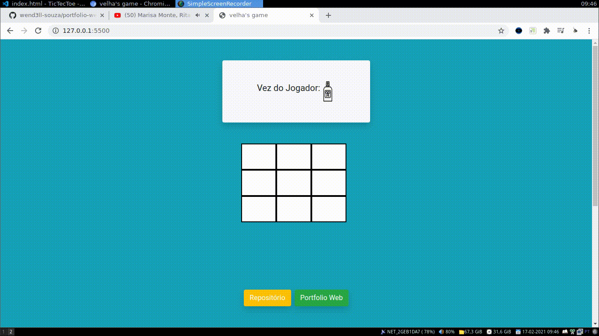

<h1 align="center">Tic Tec Toe</h1>

 Divertido Tic Tec Toe feito para praticar conhecimentos em <em>Java Script</em>

<h3 align="center">Bibliotecas Utilizadas</h3>

<h3 align="center"> Aplicação em Funcionamento </h3>
 

 
 

